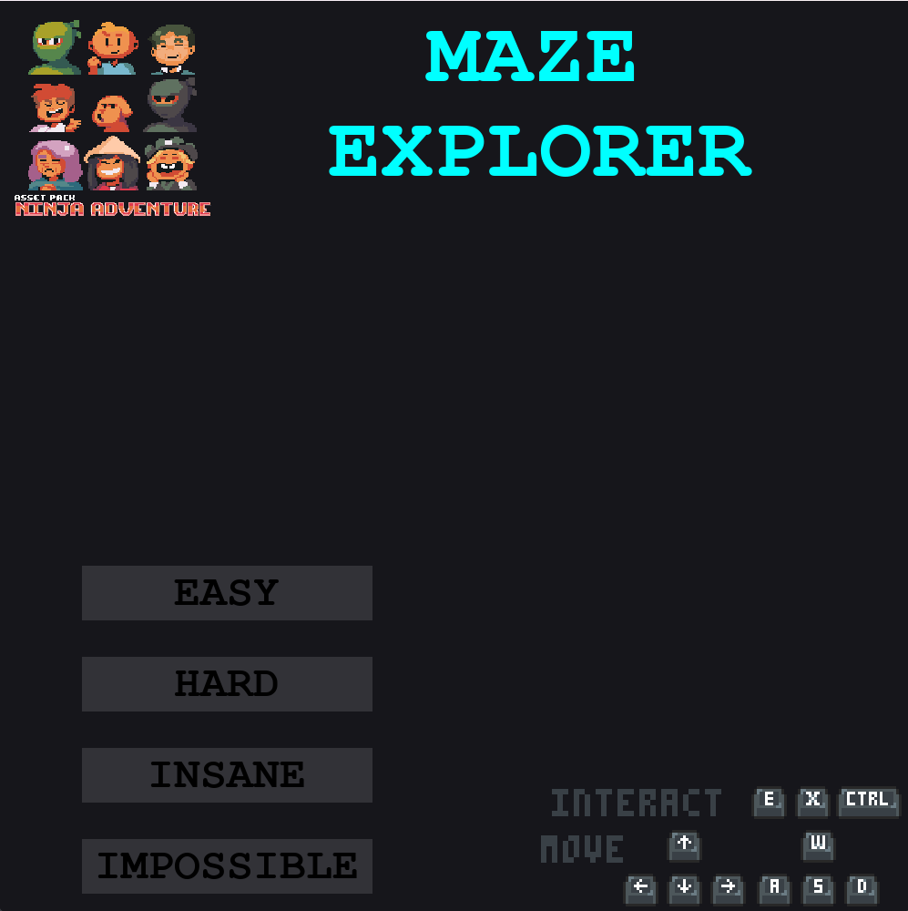
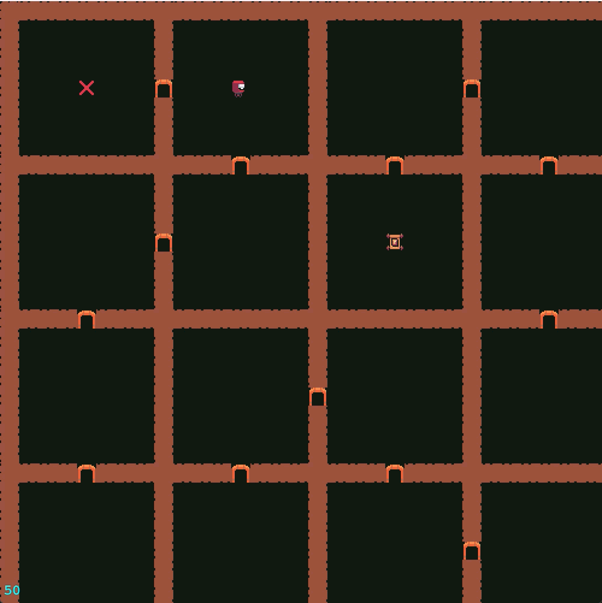
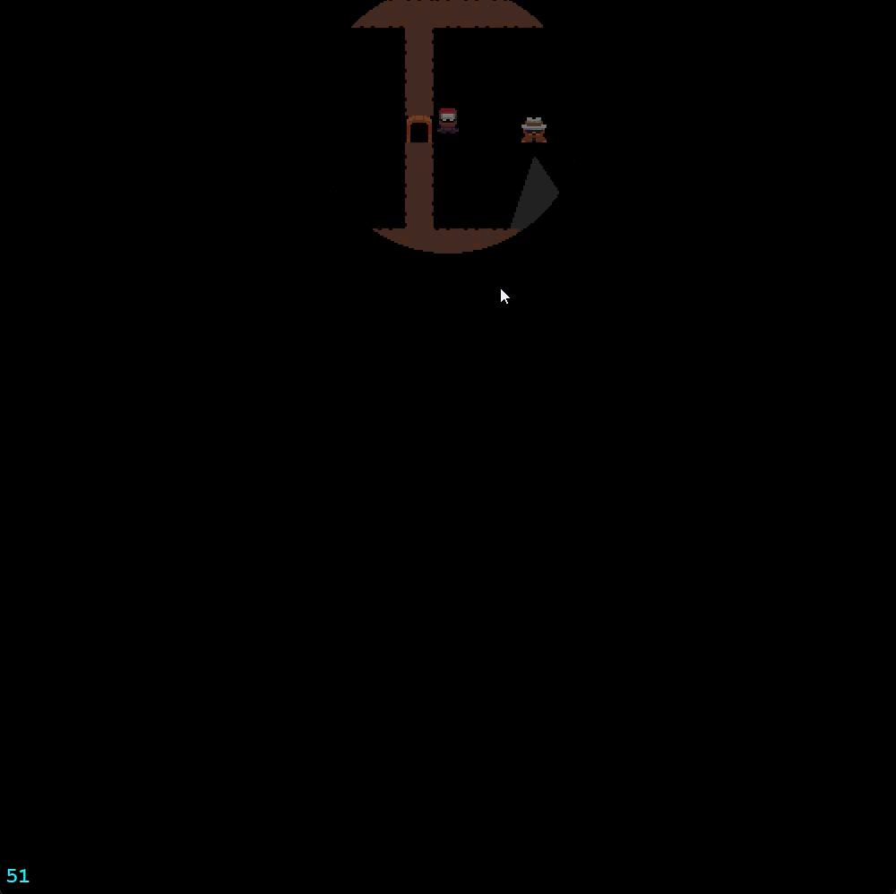
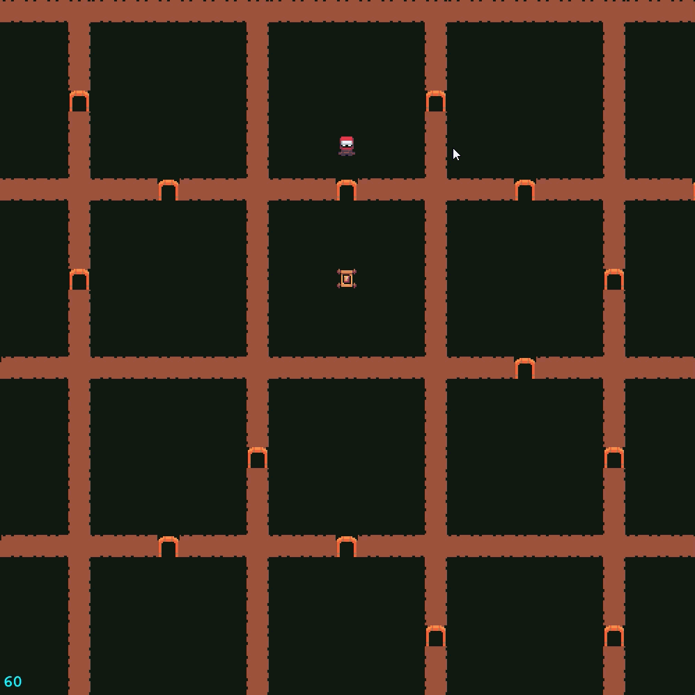

# 🔦 [INSERT CHOSEN NAME HERE] 


> **A stealth-action maze crawler built entirely from scratch in Python. Features a custom Entity-Component-System (ECS), bespoke spatial partitioning, state-driven AI, and dynamic raycasted visibility.**

 *(Replace with a wide screenshot or GIF of the title screen)*

## 📖 The Hook

The infiltration is the easy part; the escape is the real test. 

You drop into a procedurally generated facility with perfect visibility. Your goal: locate the artifact and plan your exit route. But the moment you trigger the heist, the facility goes into lockdown. The global lights cut out, your Field of View is severely restricted, and alerted AI guards begin hunting you. 

Navigate the dark, dodge their dynamic detection cones, and survive the extraction.

## 📸 Visual Showcase

### 1. The Infiltration (Exploration Phase)
 *(Replace with a GIF of the player moving through the fully lit maze, showing the procedural generation)*

### 2. The Raycasted AI 
 *(Replace with a GIF demonstrating the dynamic raycast cones bouncing off walls and searching the environment)*

### 3. The Heist (Extraction Phase)
 *(Replace with a GIF of the moment the artifact is grabbed: the screen goes dark, the player's light radius shrinks, and the guards spawn)*

## 🛠️ Technical Architecture

This project was engineered to handle complex spatial mathematics and state management without relying on pre-built game engine physics nodes (like Unity or Godot). Everything is handled via pure Python data structures.

* **Strict Entity-Component-System (ECS):** Logic is entirely decoupled. Systems (Movement, Raycasting, Rendering, Pathfinding) communicate exclusively through isolated data components and global interaction intents.
* **Custom Spatial Grid Hashing:** Entities and environments are managed through a custom discrete grid system to optimize collision and overlap detection at $O(1)$ complexity without a physics server.
* **Dynamic Raycasting:** Bespoke trigonometric raycasting algorithms calculate Guard Fields of View (FOV), dynamically clipping against walls using grid approximations.
* **Breadth-First Search (BFS) Pathfinding:** Guards navigate the discrete spatial grid using mathematically guaranteed shortest-path algorithms, dynamically switching between Chase and Return states.
* **Resolution Independence:** Custom letterboxing and scaling algorithms ensure pixel-perfect rendering at any window size or fullscreen aspect ratio.

## 🎮 How to Play

### Controls
* **[W, A, S, D]** or **[Arrow Keys]** - Move
* **[Space]** or **[E]** or or **[X]** - Interact (Grab Artifact / Extract)
* **[F11]** - Toggle Fullscreen

### The Objective
1. Explore the maze and locate the Artifact.
2. Memorize the layout and the location of the Extraction Point.
3. Grab the Artifact to trigger the Heist Phase.
4. Avoid the Guards' vision cones in the dark and reach the Extraction Point.

## 🚀 Installation & Setup

1. Clone the repository:
   ```bash
   git clone [https://github.com/yourusername/your-repo-name.git](https://github.com/yourusername/your-repo-name.git)